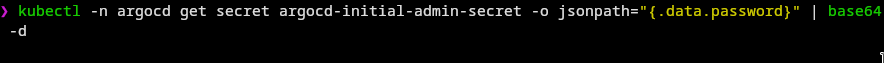

# Table of content
1. [Information about Projects](#Info)
2. [Dockerization](#docker)
3. [CI-CD](#cicd)
4. [GitOps](#gitops)
5. [Testing API](#testing)


## Information about App.<a name="info"></a>

This program is very simple, it connects to a MySQL database based on the following env vars:
* MYSQL_HOST
* MYSQL_USER
* MYSQL_PASS
* MYSQL_PORT

And exposes itself on port 9090:
* On `/healthcheck` it returns an OK message, 
* On GET it returns all recorded rows.
* On POST it creates a new row.
* On PATCH it updates the creation date of the row with the same ID as the one specified in query parameter `id`

## Dockerization<a name="docker"></a>
- Building **docker-compose.yaml** to check, if everything run locally.
	-  it works and all things are good.
	- i use  `Browser` to check api.
		
	 - i use `dbeaver` to test **DB**
	     

## CI-CD<a name="cicd">
- i wrote the pipeline to build and push image to docker hub.
-  here is a link for the docker image [docker image](https://hub.docker.com/repository/docker/nmn3m/instabug/general)

## GitOps<a name="gitops"></a>

- Start with **deploy Argocd** to minikube cluster, making namespace for it, then deploy it.
```bash
kubectl create namespace argocd
kubectl apply -n argocd -f https://raw.githubusercontent.com/argoproj/argo-cd/stable/manifests/install.yaml
```
- Expose the UI of the argoCd outside minkube.
```bash
kubectl port-forward svc/argocd-server -n argocd 8080:443
```
- Open browser and go to http://localhost:8080/
- Use **username** as **admin** and password needed to be extract
```bash
kubectl -n argocd get secret argocd-initial-admin-secret -o jsonpath="{.data.password}" | base64 -d
```
- that what appear.

- start to add application to work on, Add information
- Here is the final piece.

## Testing API <a name="testing"></a>
#### i used `postman` as tool for testing API.
-  First - On `/healthcheck` it returns an OK message
	-  it Gives me a `200` response.
-  Second - On GET it returns all recorded rows.
	-  it gives me all rows. but empty
		
-  Third - On POST it creates a new row.
	-  it give put the new row in table.
		 
	-  before ...
		 
	- after ...
	      
- Fourth - On patch it updates row 
	-  patch request
		
	- before 
		
	- after
		
